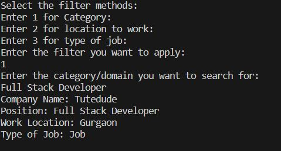
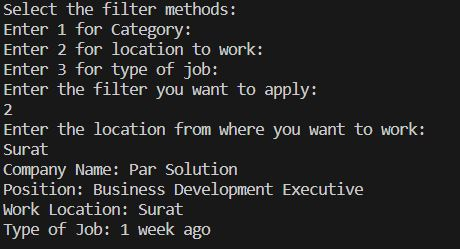
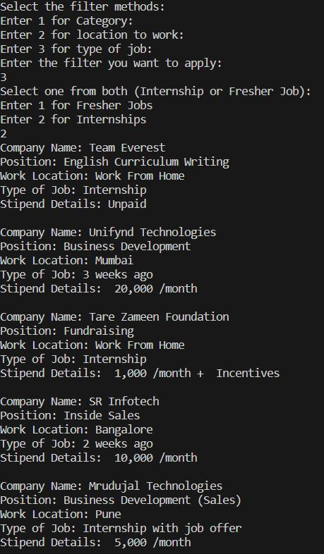
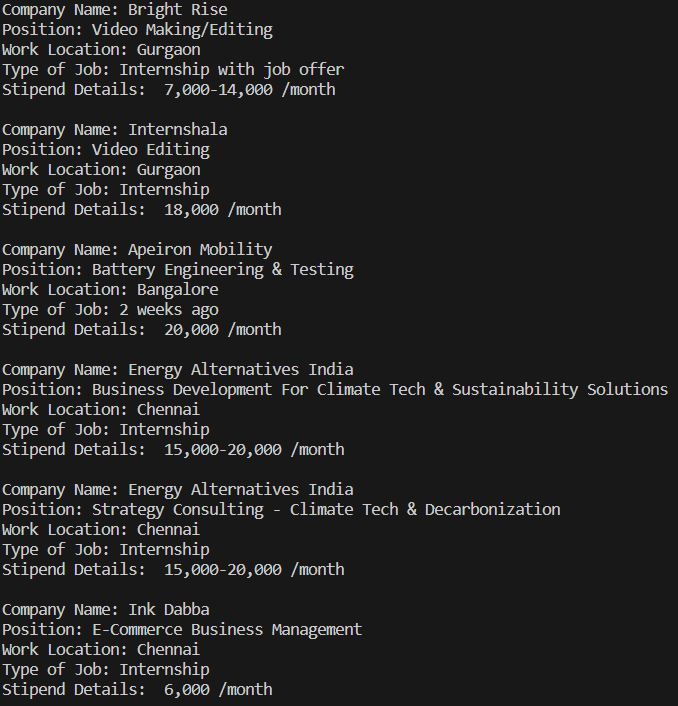
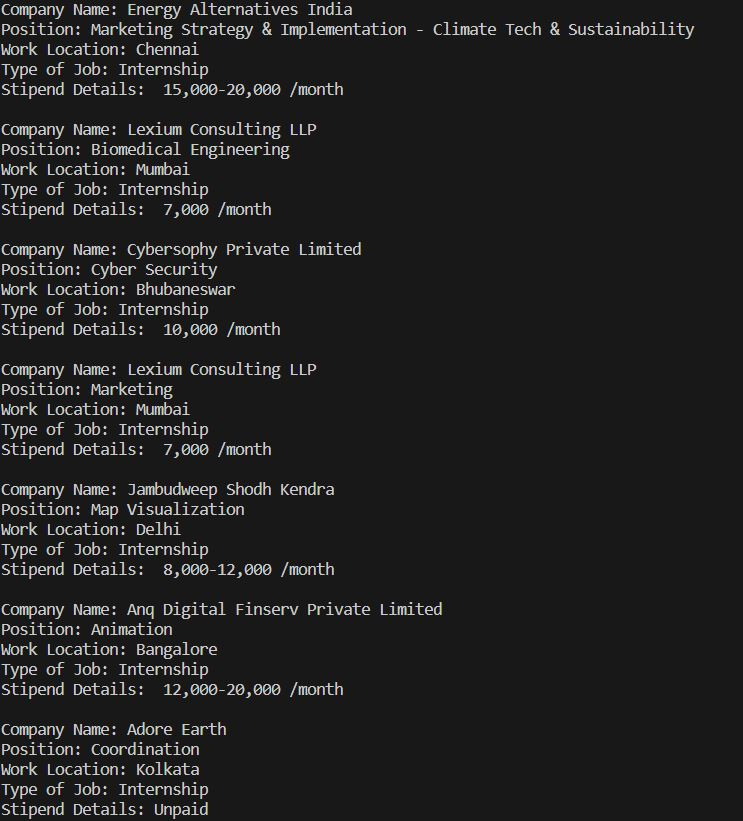
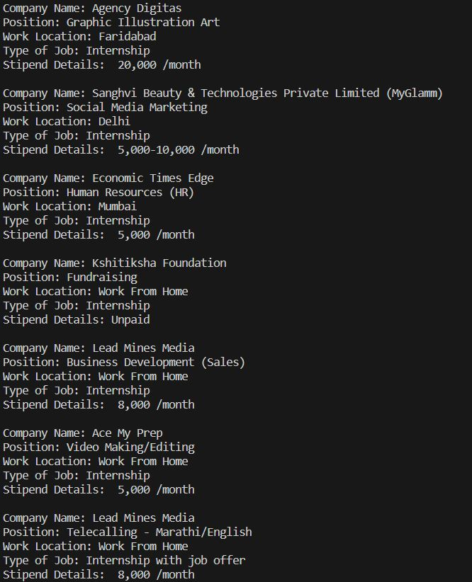

# Internshala Web Scraping

The details internships and Jobs are scrapped from the internshala.

 User input of  

<ol>
  <li> Catergory / domain of internship/Job </li>
  <li> Work place for internship/Job </li>
  <li> Type of Job (Fresher Job / Internship) </li>
</ol>

This helps to predict the internship / Jobs for the corresponding input 

<h2>Results</h2>
<h4>Selecting Job Category Results</h4>

<h4>Selecting Location to work results</h4>

<h4>Selecting Job Type results</h4>

